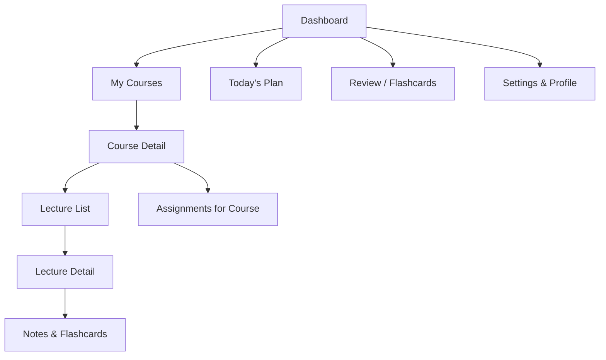
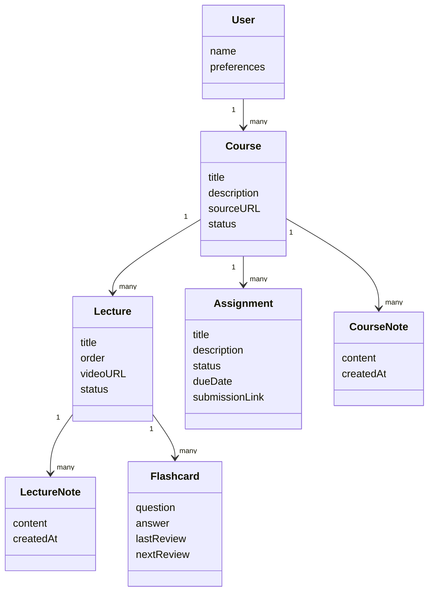
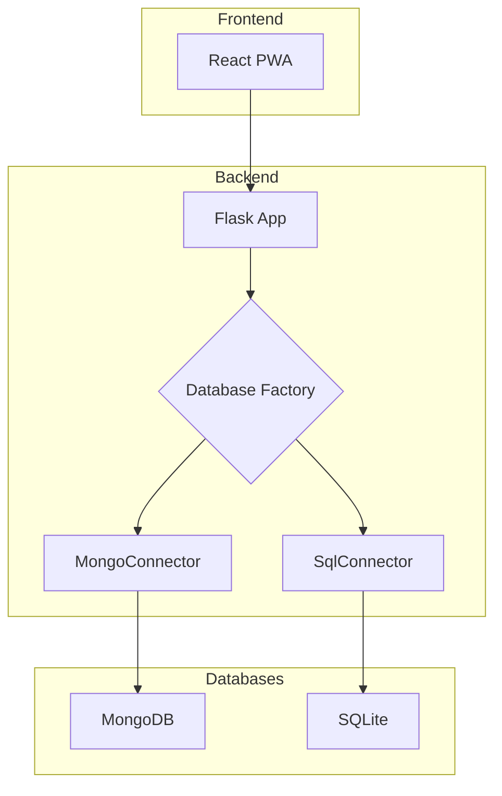

# MIT OCW Companion – Product Planning & UX Design Document

## 0. Working Title

**Working name:** _Megamind_  
Tagline: **“Learn Anything, Anywhere.”**

---

## 1. Product Overview

**Problem:**  
MIT OpenCourseWare is incredible, but:

- It’s mostly web-based and not learner-centric.
- No simple way to:
  - Track which lectures you’ve completed.
  - See your progress across multiple courses.
  - Attach your own notes, assignment links, or reflections.
  - Build and review flashcards.
- Mobile experience is “app-like”, not “website-ish”.

**Goal:**  
Create a **lightweight, app-like learning companion** for MIT OCW (and similar open courses) that:

- Lets you **organize courses** you’re following.
- Tracks **lecture progress** and **assignments**.
- Gives an **app-like mobile experience** without paying for an App Store listing.
- Stays **cheap to run** and **simple to maintain**.
- Leaves room for future features like **flashcards, reminders, and spaced repetition**.

**Core philosophy:**  
This is **your cockpit for self-learning**, not another content platform. It doesn’t replace MIT OCW. It **wraps around it**.

---

## 2. Target Users & Personas

### 2.1 Primary Persona – The Self-Directed Learner

- Age: 20–40  
- Profile: Tech-savvy, watches MIT/Stanford/Yale online courses for growth.  
- Pain points:
  - Drowns in multiple playlists and tabs.
  - Forgets where they left off.
  - Juggles PDFs, GitHub repos, notes apps, and videos.

#### Needs

- A clear overview of all courses they are following.
- A quick way to know: “What should I watch next?”
- A simple way to jot down notes and track assignments.

### 2.2 Secondary Persona – The “Structured Hobbyist”

- Works full-time, studies in **evenings/weekends**.
- Treats courses like part-time school.
- Wants:
  - Weekly progress summaries.
  - A sense of accountability.
  - Gentle nudges and milestones.

---

## 3. Core Value Proposition

**In one sentence:**  
_A personal “learning control center” for MIT OCW that feels like a native app, tracks your progress, and keeps your study life organized._

**Key value pillars:**

1. **Clarity** – Know exactly where you are across all courses.
2. **Momentum** – Make it brain-dead simple to pick the next lecture.
3. **Context** – All your notes, thoughts, and assignment links in one place.
4. **Lightweight** – Fast, minimal friction, no bloat.
5. **Low Cost** – Runs mostly on free tiers, no Apple developer license required.

---

## 4. Key Use Cases

1. **Track video progress**
   - Mark lectures as: _Not Started / In Progress / Completed_.
   - Quickly jump back to where you stopped.

2. **Plan a learning path**
   - Add multiple courses to a “Current Semester” or “Now Studying” list.
   - See total workload (lectures, estimated hours).

3. **Attach notes and resources**
   - Write quick notes for each lecture.
   - Store links to problem sets, GitHub repos, solutions.

4. **Assignment tracking (lightweight)**
   - Mark assignments as: _Planned / In Progress / Submitted / Skipped_.
   - Optionally paste submission links (GitHub, Google Drive, etc.).

5. **Future: Flashcards and spaced repetition**
   - Turn notes into flashcards.
   - Daily review view with simple “Again / Good / Easy” interactions.

6. **Sync across devices (future phase)**
   - Start a lecture on laptop.
   - Tick it as complete on phone.

---

## 5. UX Design Principles

1. **“One-swipe to clarity”**
   - From the home screen, user should know:
   - What course(s) they’re currently focused on.
   - Suggested next lecture.

2. **Minimal cognitive load**
   - Simple labels.
   - Few clicks to do common actions (mark done, add note).

3. **App-like mobile behaviour**
   - Full-screen experience when installed on home screen.
   - Smooth transitions, no “websitey” clutter.

4. **Respect the original content**
   - Clearly show that content is from MIT OCW or similar.
   - Open external links cleanly, not hidden.

5. **Offline-leaning UX**
   - Progress and notes should be resilient to flaky connections.
   - Data saved locally first, synced later (future feature).

6. **Gentle gamification, not spam**
   - Light progress bars and streaks.
   - No noisy badges or pushy popups.

---

## 6. Information Architecture (IA)

### 6.1 Top-Level Sections

- **Dashboard** – Today’s view + active courses.
- **Courses Library** – All courses you’re tracking.
- **Course Detail** – Syllabus, lecture list, progress.
- **Lecture Detail** – Video & notes for a single lecture.
- **Assignments** – Optional consolidated list across courses.
- **Review / Flashcards** (future).
- **Settings & Profile** – Preferences, backup/sync, theme.

### 6.2 IA Diagram (Mermaid)

---

## 7. User Journeys

### 7.1 First-Time User Journey

 1. Lands on Welcome / Onboarding screen.
 2. Brief explanation: “This app helps you track MIT OCW and other open courses.”
 3. Prompt: “Add your first course.”
    - Option A: Paste a course URL (OCW / YouTube playlist).
    - Option B: Manually enter course details.
 4. App shows Course Detail View:
    - Auto-filled or minimal skeleton with:
    - Course name, description (user can edit).
    - Space for lectures (user can add).
 5. User adds first few lectures with URLs.
 6. Returns to Dashboard, sees:
    - One “Active Course”.
    - “Next Lecture: [Lecture 1 name]”.
 7. User taps lecture → opens Lecture Detail and external video.
 8. After watching, user marks it as Completed.

### 7.2 Returning User Journey (Daily Use)

 1. Opens app → Dashboard.
 2. Sees:
    - “Welcome back, [Name]”
    - “You have 1 course in progress.”
    - Primary call to action: “Continue: [Course Name] – Lecture [N]”
 3. One tap → taken to Lecture Detail.
 4. Optional:
    - Writes a quick note.
    - Marks lecture as done.
 5. Dash updates progress bar & completion stats.

### 7.3 “Course Binge” Journey

 1. User decides to dedicate a weekend to one course.
 2. From Dashboard:
    - Goes to My Courses.
    - Taps one course to pin as “Focus course” (optional).
 3. In Course Detail:
    - Sees lecture list with status chips.
    - Tap → play → mark done.
 4. At the end of the binge:
    - Sees updated completion percentage.
    - “You’re 40% done with this course.”

### 7.4 Assignments Journey

 1. In Course Detail, user scrolls to Assignments section.
 2. Each assignment has:
    - Name (e.g., “Problem Set 1”).
    - Due date (optional, user-defined).
    - Status: Not Started / In Progress / Submitted / Skipped.
 3. User taps into assignment:
    - Adds link(s) to PDF, repo, Google Doc.
    - Adds short reflection: “This was hard/easy because…”
 4. Later, user can filter Dashboard for “Assignments due this week” (future).

### 7.5 Flashcards / Review Journey (Future)

 1. From Lecture Detail, user flags some notes as flashcards.
 2. In Review tab, app shows:
    - “You have 10 cards to review today.”
 3. Flow:
    - See question → think → tap to reveal answer → rate (Again / Good / Easy).
 4. Cards get scheduled for later review based on ratings.

---

## 8. Screen-by-Screen UX Overview

This section describes what the user sees and does per screen.
No implementation details, just behaviour and layout concepts.

### 8.1 Dashboard

#### Purpose

Give the user a clear, quick overview of where they are and what to do next.

#### Sections

 1. Header
    - Greeting: “Hi, [Name]”
    - Small subtitle: “Let’s make some progress today.”
 2. Today’s Plan
    - Card showing:
    - “Next up: [Course Name] – Lecture [#]”
    - One primary button: “Resume”
    - Optional: estimated time (e.g., “50 min”).
 3. Active Courses
    - Horizontal or vertical list of course cards:
    - Course name
    - Progress bar (% completed)
    - Lecture count (e.g., “10/32 lectures done”)
    - Tap → Course Detail.
 4. Assignments Snapshot (optional)
    - “Assignments this week”
    - A small list with status tags.
 5. Review (Future)
    - Banner: “You have [N] flashcards to review.”
    - Button: “Start review”.

#### Key interactions

- Tap on course card → Course Detail.
- Tap on “Resume” → Lecture Detail for next lecture.

---

### 8.2 My Courses (Library)

#### Purpose

A structured overview of all courses being tracked.

#### Design

- Segmentation tabs:
- Active
- Completed
- Someday / Parked (future)
- Course cards:
  - Course title
- Source (MIT OCW / Other)
- Progress bar
- Tag: “In progress”, “Not started”, “Completed”.

Actions:

- Add new course (floating action button or top-right button).
- Long-press / three-dot menu:
  - Edit course
- Move to Completed
- Delete course
- Pin as Focus Course.

---

### 8.3 Course Detail

#### Purpose

Show everything about a single course and make it easy to proceed.

#### Layout

 1. Course Header

    - Title
    - Short description (editable).
    - Source link (opens MIT OCW / YouTube).

 2. Progress Summary

    - Big progress bar.
    - Stats: “You’ve completed 5 of 24 lectures.”

 3. Tabs / Sections:

    - Lectures
    - Assignments
    - Notes
    - Resources (links to PDFs, external pages).

#### Lectures Section

- List view:
- Lecture number + title.
- Icons for status:
  - Empty circle = Not Started
  - Half circle = In Progress
  - Checkmark = Completed
  - Duration (optional).
- Tapping lecture card:
  - Opens Lecture Detail screen.

#### Quick Action

“Mark next N lectures as planned for this week” (future).

#### Assignments Section

- List of assignments with:
- Name
- Linked lecture range (if any)
- Status pill (color-coded).

#### Notes Section

- Course-level notes:
- Long-form notes area.
- Optional tags (e.g., “exam prep”, “project ideas”).

#### Resources Section

- List of links:
- Syllabus
- PDF notes
- Problem sets index

---

### 8.4 Lecture Detail

#### Purpose

Anchor for a single lecture: status, video link, and notes.

#### Layout

 1. Header
    - Lecture title (e.g., “Lecture 3 – Asymptotic Notation”).
    - Course name subtitle.
 2. Video Area
    - Large button: “Open video”.
    - Opens YouTube/OCW in same or new view.
    - Optional: embed preview thumbnail.
 3. Lecture Status
    - Status selector:
    - Buttons / chips: Not Started / In Progress / Completed.
    - Checkbox: “Count as watched”.
 4. Notes
    - Simple text area:
    - “What did you learn?”
    - “Any questions to revisit?”
 5. Flashcards Preview (Future)
    - Small list of flashcards created from this lecture.
    - Button: “Add flashcard”.

Interactions:

- Marking as “Completed” should immediately reflect back on Course Detail & Dashboard.
- Notes auto-save as user types.

---

8.5 Assignments Overview (Global)

Purpose:
Optional global view: all assignments across all courses.

Layout:

- Filter bar:
- By course
- By status (Not Started / In Progress / Submitted)
- By due date.
- List:
  - Assignment name
- Course name
- Due date
- Status pill.

#### Use case

User wants to plan a weekend around all pending work.

---

### 8.6 Review / Flashcards (Future)

#### Purpose

Space for intentional review rather than passive watching.

#### Layout

- Summary:
- “You have [N] cards due today.”
- Button: “Start Review”.
- Review flow:
  - Card shows Question (front).
  - Tap → reveal Answer (back).
  - Rating buttons:
  - Again
  - Good
  - Easy

#### Behaviour

- Simple scheduling:
- “Again” → sooner.
- “Easy” → later.
- Designed to feel lightweight, not like exam software.

---

### 8.7 Settings & Profile

#### Purpose

Control over preferences and data.

#### mKey items

- Name / display name.
- Theme (Light / Dark).
- Sync & backup:
  - “Backup data to cloud” (future).
  - “Export data” (JSON/CSV for personal backup).
- Device:
  - “Install on Home Screen” instructions (for PWA on iOS).
- About:
  - Transparency: “This app doesn’t host MIT content; it just organizes your learning.”

---

## 9. Conceptual Data Model (Non-Technical)

This is about concepts and relationships, not implementation details.

### 9.1 Entities

- User
- Identity (optional for v1 if local-only).
- Preferences (theme, reminders).
- Course
  - Title, description.
  - Source (OCW URL, YouTube playlist, etc.).
  - Status (Active, Completed, Parked).
- Lecture
  - Belongs to a single Course.
  - Title, number/order, external video URL.
  - Status (Not Started, In Progress, Completed).
- Assignment
  - Linked to a Course (and optionally specific lectures).
  - Name, description, optional due date.
  - Status (Not Started, In Progress, Submitted, Skipped).
  - Submission link(s).
- Note
  - Linked to either a Course or a Lecture.
  - Content (rich text or plain).
  - Timestamp(s).
- Flashcard (Future)
  - Linked to a Lecture (and possibly a Note).
  - Fields: Question, Answer.
  - Scheduling metadata (last review, next review).

### 9.2 Conceptual Diagram (Mermaid)

---

## 10. Accessibility & Inclusivity Considerations

- Readable typography
- Clear font sizes and spacing; large tap targets for mobile.
- Color contrast
  - Progress bars and status pills must be distinguishable even for color-blind users.
- Keyboard navigation (desktop)
  - Ability to navigate through lectures and mark status using keyboard only.
- Low-distraction mode
  - Option for a “Focus mode”:
    - Minimal UI when viewing Lecture Detail.
    - Hides unnecessary elements while note-taking.
- Device adaptability
  - Layout adjusts gracefully between:
    - Narrow phone screens.
    - Tablet.
    - Desktop.

---

## 11. Future Enhancements (UX-Level)

 1. Smart suggestions
    - “You’ve been stuck at Lecture 5 for 2 weeks, want to schedule time?”
    - “You usually study Tuesday nights; here’s what’s next.”
 2. Calendar integration
    - Add “study sessions” or assignment due dates to calendar.
 3. “Reflection mode”
    - End-of-course summary: what you learned, key highlights, bookmarks.
 4. Personal OKR-style goals
    - “Finish 2 courses this quarter.”
    - “Watch 3 lectures per week.”
 5. Import helpers
    - Paste a playlist URL → auto-create lectures.
    - Paste an OCW URL → auto-fill course title & links (still respecting their site).
 6. Collaboration (very future)
    - Share your course config (not your notes) with friends.
    - Group study mode.

---

## 12. High-Level Tech Direction (Non-Technical)

This section is intentionally high-level and avoids deep technical details, while still justifying long-term choices.

### 12.1 Platform Strategy

- Primary: A modern, responsive web application that can be “installed” on phones and tablets as a Progressive Web App (PWA).
- Why PWA first?
  - Avoids the Apple developer fee and App Store friction.
  - One codebase for desktop + mobile.
  - “App-like” UX (home-screen icon, full-screen view).
  - Aligns with low-cost and high-speed iteration.

### 12.2 Backend & Data

- **Backend**: A Python-based Flask server that provides a REST API for the frontend.
- **Database**: The backend uses a factory pattern to support multiple database backends. The two currently implemented connectors are:
  - **SQLite**: A lightweight, file-based SQL database, ideal for local development and testing.
  - **MongoDB**: A NoSQL document database, suitable for more complex data structures and scalability.
- **Default**: The system is configured to use MongoDB by default.

- **Architecture**: The backend abstracts the database implementation, allowing for easy switching between database systems. The frontend interacts with a consistent REST API, regardless of the underlying database.
- **Rationale**: This decoupled architecture centralizes data management, ensures data consistency, and simplifies both frontend and backend development. The factory pattern provides flexibility and extensibility for future database integrations.

### 12.3 Hosting & Operations

- Static hosting provider with:
- Free plan sufficient for personal/project use.
- Automatic deployments from a code repository.
- Global content delivery network out of the box.
- Scalability & Future-Proofing
- Start with a design that can:
  - Scale from one user to many without structural redesign.
- Support future migration to:
  - A more powerful backend.
- Native shells (if ever wrapping as iOS/Android).

### 12.4 Community & Learning Considerations

- Preference for popular, well-documented front-end frameworks:
- Large communities.
- Abundant learning resources and examples.
- Long-term support from the ecosystem.
- Preference for open, SQL-like storage on the backend (when added):
  - Easier to understand conceptually.
- Well-supported by tools and ORMs.
- More portable if migrating in future.

---

## 13. Phased Rollout (Non-Technical Roadmap)

### Phase 0 – Concept & Prototyping (Design Only)

- Finalize UX flows (this document).
- Sketch low-fidelity wireframes for key screens.
- Validate with personal usage thought experiments (“Does this actually solve my chaos?”).

### Phase 1 – Local-Only MVP

- Implement:
- Dashboard
- My Courses
- Course Detail
- Lecture Detail
- Local data persistence.
- Aim: Personal use, no accounts, simple mongodb backend.

### Phase 2 – Sync & Cross-Device

- Introduce optional login.
- Store data centrally while still caching locally.
- Implement backup/export options.

### Phase 3 – Assignments & Flashcards

- Layer in assignment tracking UI.
- Add a basic spaced repetition flow.
- Keep interaction minimal and fun, not academic torture.

### Phase 4 – Polish & Public Release (Optional)

- Improve visuals, animations, micro-interactions.
- Consider sharing the project as:
  - A free tool for other learners.
- A portfolio/proof-of-work piece.

---

## 14. Summary

The MIT OCW Companion is not trying to be a new “learning platform”. It’s a personal cockpit for serious self-learners:

- Keeps all your MIT/open course progress, notes, and assignments in one place.
- Feels like a native app on mobile without the Apple tax.
- Starts with a local-only, zero-cost core, and grows into sync, flashcards, and planning tools as needed.
- Designed around clarity, momentum, and low-friction learning, not bloated features.

This design document is the blueprint for what the product should be for the learner, without locking into any specific implementation yet.
