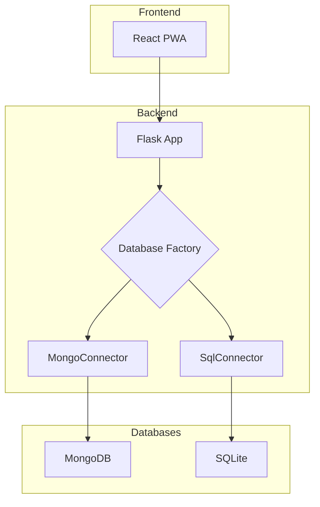
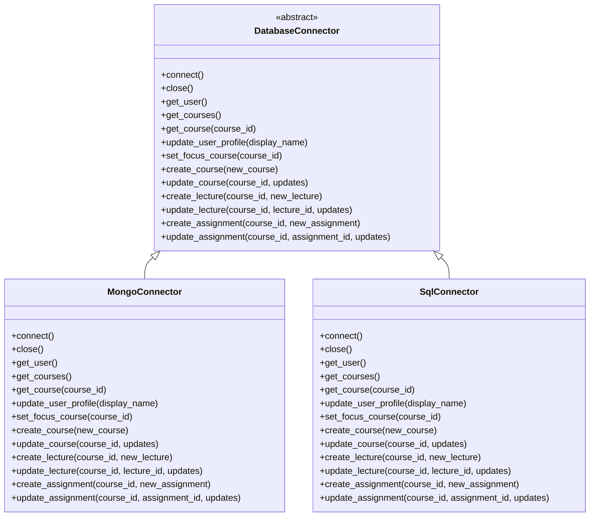

# Backend Technical Implementation

This document provides a detailed overview of the backend architecture, focusing on the database abstraction layer and the different data persistence mechanisms.

## 1. High-Level Architecture

The backend is a Flask application that serves a REST API to the frontend. It is designed to be stateless, with all application data persisted in a database. A key feature of the backend is its database abstraction layer, which allows for easy switching between different database systems.



## 2. Database Abstraction Layer

The database abstraction layer is designed to provide a consistent interface for interacting with different database systems. It consists of three main components:

- **`DatabaseConnector` (base.py)**: An abstract base class that defines the common interface for all database connectors. It includes methods for both reading and writing data.
- **`MongoConnector` (mongo.py)**: A concrete implementation of the `DatabaseConnector` for MongoDB.
- **`SqlConnector` (sql.py)**: A concrete implementation of the `DatabaseConnector` for SQLite.

### 2.1 DatabaseConnector Interface

The `DatabaseConnector` interface defines the following methods:

- `connect()`: Connect to the database.
- `close()`: Close the database connection.
- `get_user()`: Retrieve the user.
- `get_courses()`: Retrieve all courses.
- `get_course(course_id)`: Retrieve a single course.
- `update_user_profile(display_name)`: Update the user's profile.
- `set_focus_course(course_id)`: Set the user's focus course.
- `create_course(new_course)`: Create a new course.
- `update_course(course_id, updates)`: Update an existing course.
- `create_lecture(course_id, new_lecture)`: Create a new lecture.
- `update_lecture(course_id, lecture_id, updates)`: Update an existing lecture.
- `create_assignment(course_id, new_assignment)`: Create a new assignment.
- `update_assignment(course_id, assignment_id, updates)`: Update an existing assignment.

### 2.2 Class Diagram



## 3. Database Factory

The database factory (`factory.py`) is a simple function that returns an instance of a database connector based on a string identifier. This allows the application to easily switch between database backends by changing a single configuration value.

```python
def get_db_connector(connector_type: str = "mongo") -> DatabaseConnector:
    """Factory function to get a database connector."""
    connector = _connectors.get(connector_type)
    if not connector:
        raise ValueError(f"Unsupported database connector type: {connector_type}")
    return connector
```

## 4. Seeding the Database

The backend includes two seed scripts:

- **`seed.py`**: For populating a SQLite database.
- **`seed_mongo.py`**: For populating a MongoDB database.

These scripts read the initial data from `backend/data/seed.json` and insert it into the respective databases. The MongoDB seed script also clears any existing data in the collections before inserting the new data.
